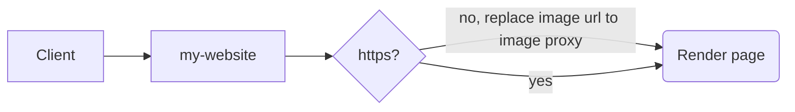
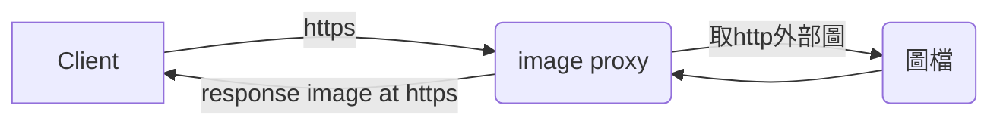

# Https Image Proxy

Some outbound image didn't provide https protocol, so we need to fetch the image back and display on our own https.

Unfortunately, you can only access outbound images though intranet proxy, which means  you need to setup related domain whitelist. You would not know how many domain you need to setup with. We need to build this outside the intranet.

Lambda(Serverless service)看似更符合這需求

# How to use

## setup

## use

### parameter
?p=\<image url\>
- example
https://{lambda-instance}.amazonaws.com/prod?p=http://{domain}/pic.png

## 程式
lang: golang 
version: 1.10
## Monitoring

## Flow

Render page

Image proxy

# Issue
- API Gateway 的body有上限6MB，因此超過6MB的圖無法處理
- Cache issue 
因為是認url,應該認到uri (含?後帶的參數)，所以得在method裡選cache

# TODO
- 如果是https uri應該直接redirect就好了，不用透過lambda重抓
- 未利用http 304 應用

